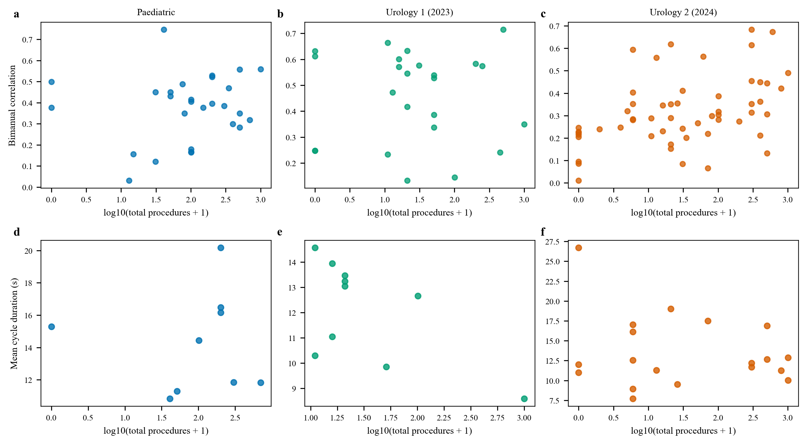
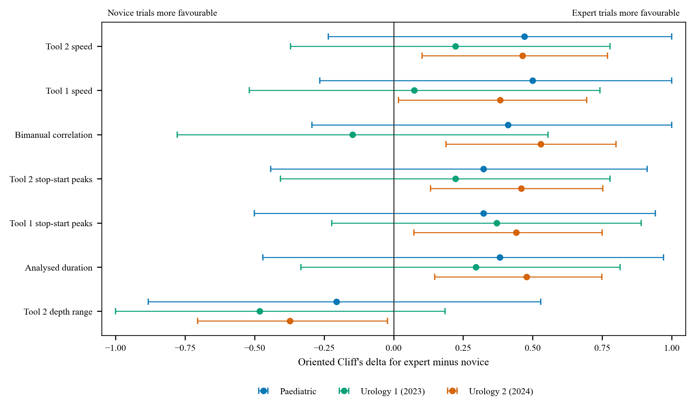
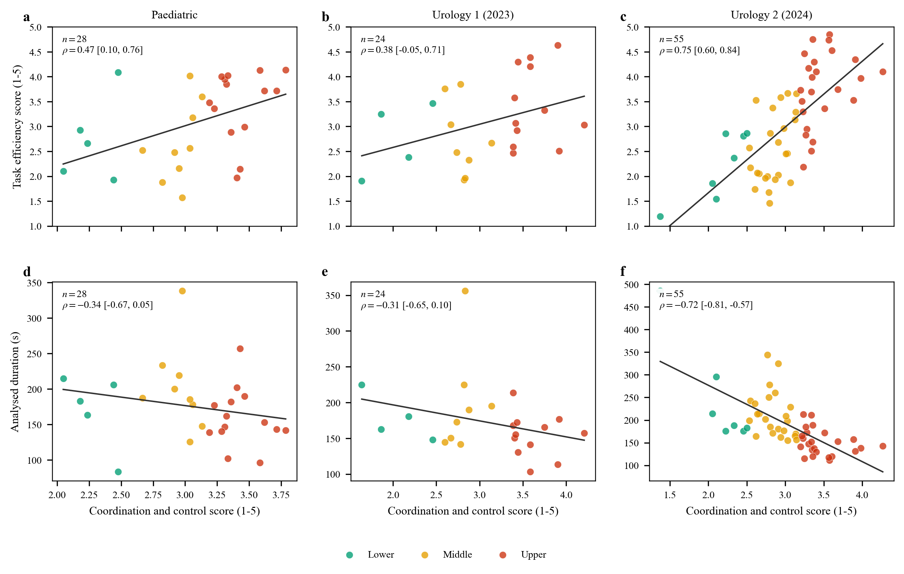

# LASK

**LA**paroscopic **S**kill and **K**inematics is a laparoscopic peg-transfer
dataset that pairs endoscopic video with electromagnetic measurements from two
instruments, manual instrument annotations, and participant experience
metadata.

[](https://doi.org/10.5281/zenodo.20752650)
[](https://zenodo.org/records/20752651)
[](docs/ANALYSIS.md)
[](https://github.com/omariosc/LASK/actions/workflows/validate.yml)
[](LICENSE)

> **Release status**
>
> [Zenodo version 1.0](https://zenodo.org/records/20752651) contains 37
> recordings. The complete 115-recording collection used by the quantitative
> analysis will be added to the same
> [concept DOI](https://doi.org/10.5281/zenodo.20752650). This repository
> already provides the analysis code, aggregate results, feature definitions,
> and representative figures. It does not expose participant-level data from
> recordings that have not yet been released.

## Start here

- [Dataset guide](docs/DATASET.md)
- [Quantitative analysis](docs/ANALYSIS.md)
- [Motion feature definitions](docs/FEATURES.md)
- [Phase annotation protocol](docs/PHASES.md)
- [Analysis script](scripts/build_scirep_analysis.py)
- [Aggregate result tables](data/derived)
- [Representative figures](paper/figures)

## Collection at a glance

The three cohorts used different collection settings. Raw measurements should
therefore be interpreted within cohort or with cohort included explicitly in
the statistical model.

| Cohort | Collection | Instrument channels | Frame rate | Public v1.0 | Complete collection |
|:--|:--|:--|--:|--:|--:|
| Paediatric | British Association of Paediatric Endoscopic Surgeons meeting, November 2024 | Position, orientation, relative jaw opening | 13 frames/s | 10 | 30 |
| Urology 1 | Urology boot camp, October 2023 | Position and orientation | 26 frames/s | 8 | 24 |
| Urology 2 | Urology boot camp, October 2024 | Position, orientation, relative jaw opening | 13 frames/s | 19 | 61 |
| **Total** |  |  |  | **37** | **115** |

The public release is organised as Urology 2 training data, Paediatric
validation data, and Urology 1 testing data. The names `7DOF2024`,
`BAPES2024`, and `6DOF2023` are retained in files for compatibility.

## What each recording contains

- Endoscopic video of a complete peg-transfer attempt.
- Three-dimensional tool position in millimetres for both instruments.
- Tool orientation as a unit quaternion for both instruments.
- A relative jaw-opening signal in the two seven-channel cohorts. This is a
  per-recording voltage-derived opening fraction, not an absolute jaw angle.
- Manual masks and instrument landmarks on selected video frames.
- Self-reported handedness and laparoscopic procedure experience where
  collected.
- Dense action-phase labels for the currently annotated subset.

The electromagnetic sensor is mounted near the instrument base and calibrated
to estimate tool-tip position. The complete data structure and coordinate
conventions are described in the [dataset guide](docs/DATASET.md).

## Quantitative analysis

The companion analysis keeps four denominators separate.

| Analysis unit | Recordings | Study identifiers | Purpose |
|:--|--:|--:|:--|
| Complete inventory | 115 | 111 | Describe every available recording |
| Primary motion set | 107 | 107 | Motion inference without repeated identifiers |
| Phase inventory | 38 | 37 | Describe every densely annotated recording |
| Primary phase set | 34 | 34 | Phase comparisons without repeated identifiers |

The 38 phase-labelled recordings contain 425 placement-complete transfer
cycles. The primary phase set contains 383 cycles.

The main findings are:

- No novice, intermediate, and expert procedure-count comparison remained
  significant after correction across 29 motion features.
- Eight features had modest within-cohort associations with lifetime procedure
  volume. Longer experience was associated with shorter analysed duration,
  lower normalised jerk, fewer speed peaks, shorter Tool 1 path length, faster
  Tool 2 movement, and stronger bimanual correlation.
- Cohort accounted for 88% and 92% of the variation in Tool 1 and Tool 2 speed,
  respectively. This shows why unadjusted pooling across collection settings is
  misleading.
- Data-derived lower, middle, and upper motion-score bands had negligible
  agreement with procedure-count groups (adjusted Rand index 0.019). These are
  descriptive motion strata, not clinical skill grades.
- Models recovered the motion-score rule with high accuracy because the target
  was calculated from the same motion domains. This is a software consistency
  check and must not be interpreted as independent skill prediction.

Full methods, confidence intervals, corrected probability values, sensitivity
analyses, and limitations are provided in the
[analysis guide](docs/ANALYSIS.md).

## Representative results

### Procedure experience and motion



The same experience measure can have different motion relationships in each
cohort. The top row shows bimanual correlation across all 107 primary
recordings. The lower row uses the phase-labelled subset to show mean cycle
duration. Corrected all-recording results are available in
[`all_trial_feature_statistics.csv`](data/derived/all_trial_feature_statistics.csv).

### Why cohort adjustment matters



Each colour shows the expert-minus-novice effect estimated within one cohort.
The wide and sometimes inconsistent intervals show why a pooled effect can
hide acquisition-specific uncertainty. The analysis therefore avoids treating
the three cohorts as if their coordinate systems and equipment were
interchangeable.

### Continuous score checks



The coordination and control score is interpreted continuously. Duration and
task efficiency are shown as contextual measurements rather than external
clinical validation.

Additional examples include the
[cohort inventory](paper/figures/fig1_cohort_structure.png) and
[phase timing analysis](paper/figures/fig3_phase_timing.png).

## Reproducing the analysis

Create an environment and install the recorded package versions:

```bash
python3 -m venv .venv
source .venv/bin/activate
python -m pip install -r requirements.txt
```

The script uses the sibling `BTPN-MT` and `AI-ELT` paths by default. Other
locations can be supplied explicitly:

```bash
export LASK_PHASE_CACHE=/path/to/phase_cache
export LASK_AI_ELT_ROOT=/path/to/AI-ELT
export LASK_ORIGIN_MOTION=/path/to/per_recording_kinematic_json
python scripts/build_scirep_analysis.py
```

Expected inputs and their schemas are listed in
[`data/README.md`](data/README.md). The current Zenodo release does not yet
contain every cache needed to regenerate the 115-recording paper analysis.
Until the staged release is expanded, the repository provides the aggregate
outputs and file hashes produced by the complete internal collection.

## Interpretation boundaries

Procedure volume is an experience measure, not a direct assessment of
competence. The motion-score bands are relative partitions of two calculated
motion domains. They are not scores from the Objective Structured Assessment
of Technical Skills, Global Operative Assessment of Laparoscopic Skills,
Global Evaluative Assessment of Robotic Skills, McGill Inanimate System for
Training and Evaluation of Laparoscopic Skills, or Fundamentals of
Laparoscopic Surgery.

One trained researcher annotated the action phases. Participant experience
metadata were not visible during annotation. Differences in apparent
confidence and fluency could still be perceived from the videos, but informal
impressions of skill were not recorded and were not used to define phase
labels. Independent phase annotation and expert rating remain planned
validation work.

## Citation

Please cite the dataset using the concept DOI so that the citation resolves to
the latest release:

```bibtex
@dataset{Choudhry2026LASK,
  title     = {LASK: A Dataset for Laparoscopic Skill and 7-DoF Kinematics},
  author    = {Choudhry, Omar and Jones, Dominic},
  year      = {2026},
  publisher = {Zenodo},
  doi       = {10.5281/zenodo.20752650},
  url       = {https://doi.org/10.5281/zenodo.20752650}
}
```

The original dataset paper and related work are listed in
[`CITATION.cff`](CITATION.cff).

## Licence and contact

The dataset and repository contents are released under the
[Creative Commons Attribution 4.0 licence](LICENSE). For questions, open a
GitHub issue or contact
[Omar Choudhry](https://omarchoudhry.co.uk), School of Computing,
University of Leeds.
